# DeerFlow 中间件链完整执行流程图

## Agent 一次完整循环的调用路径

```mermaid
flowchart TB
    subgraph "① before_agent（正序 — 从左到右执行）"
        direction LR
        BA1[ThreadDataMiddleware\n创建线程工作目录] --> BA2[UploadsMiddleware\n注入上传文件信息\n转换为结构化MD] --> BA3[SandboxMiddleware\n获取/创建沙箱环境] --> BA4[DynamicContextMiddleware\n注入长期记忆+当前日期] --> BA5[TodoMiddleware\n清理上个run残留的\n完成提醒内存数据] --> BA6[LoopDetectionMiddleware\n清理前一个run\n遗留的循环警告]
    end

    subgraph "② wrap_model_call（洋葱模型外层→内层）"
        direction TB
        WMC1["ToolOutputBudgetMiddleware\n检查历史ToolMessage\n超长则压缩再调LLM"] --> WMC2
        WMC2["LLMErrorHandlingMiddleware\n包裹handler实现:\n1.指数退避重试(3次)\n2.熔断保护(5次失败停60s)\n3.优雅降级返回错误AIMessage"] --> WMC3
        WMC3["SkillActivationMiddleware\n检测/skill-name语法\n插入SKILL.md完整内容\n到上下文"] --> WMC4
        WMC4["TodoMiddleware\n夹带completion_reminder\n（通知还有未完成任务）"] --> WMC5
        WMC5["LoopDetectionMiddleware\n夹带循环警告\n（检测到重复调用时）"] --> LLM_CALL
    end

    subgraph "③ before_model（正序 — 从左到右执行）"
        direction LR
        BM1["DanglingToolCallMiddleware\n补充缺失的ToolMessage\n防止provider报错"] --> BM2
        BM2["SummarizationMiddleware\n判断是否需要摘要压缩\n（token数/消息数超过阈值）"] --> BM3
        BM3["TodoMiddleware\n检查write_tools是否\n被摘要压缩出上下文\n注入todo_reminder提醒"] --> BM4
        BM4["ViewImageMiddleware\n将图片消息转为\nbase64注入state"]
    end

    LLM_CALL["⚡ LLM 调用"]

    subgraph "④ after_model（逆序 — 最后append的先执行）"
        direction RL
        AM1["LoopDetectionMiddleware\n计算tool_calls哈希\n与滑动窗口比对\n>=3次警告 / >=5次硬停"] --> AM2
        AM2["SubagentLimitMiddleware\n检查task调用数量\n超过max_concurrent(3)时\n截断多余的task"] --> AM3
        AM3["TokenUsageMiddleware\n1.记录LLM返回的\ntoken用量到日志\n2.子任务token回溯\n合并到调度的AIMessage\n3.构建step_attribution\n为前端步骤分解提供数据"] --> AM4
        AM4["TitleMiddleware\n第一轮结束后\n生成对话标题\n（调用大模型/本地兜底）"] --> AM5
        AM5["TodoMiddleware\n检查是否提前退出\n有未完成todo时\n注入提醒+强制跳回model"]
    end

    subgraph "⑤ wrap_tool_call（洋葱模型外层→内层）"
        direction TB
        WTC1["ToolOutputBudgetMiddleware\n截断超大工具输出\n外部化到文件+预览"] --> WTC2
        WTC2["GuardrailMiddleware（可选）\n检查工具名是否在\n拒绝/允许名单中"] --> WTC3
        WTC3["SandboxAuditMiddleware\n仅bash命令:\n1.输入校验(空/null/超长)\n2.命令分类(高危/警告/允许)\n3.审计日志记录"] --> WTC4
        WTC4["ToolErrorHandlingMiddleware\ntry/except包裹handler\n异常转ToolMessage(error)\n子agent状态打标"] --> WTC5
        WTC5["ClarificationMiddleware\n拦截ask_clarification\n封装ToolMessage\n返回Command(goto=END)\n中断Agent循环"]
    end

    TOOL_EXEC["🔧 Tool 执行\nasyncio.gather 并发执行"]

    subgraph "⑥ after_agent（逆序 — 收尾清理）"
        direction RL
        AA1["MemoryMiddleware\n过滤消息(去掉工具调用)\n检测纠正/强化信号\n入队MemoryUpdateQueue\n后台线程异步更新memory.json"] --> AA2
        AA2["TodoMiddleware\n清理当前run的\n完成提醒内存数据"] --> AA3
        AA3["LoopDetectionMiddleware\n清理当前run的\n循环警告队列"]
    end

    %% 连接路径
    BA1 --> BA2 --> BA3 --> BA4 --> BA5 --> BA6
    BA6 --> WMC1

    WMC5 --> BM1
    BM4 --> LLM_CALL

    LLM_CALL --> AM1
    AM5 --> WTC1
    
    WTC5 --> TOOL_EXEC

    TOOL_EXEC -- "还有tool_calls" --> WMC1
    TOOL_EXEC -- "没有tool_calls" --> AA1

    style BA1 fill:#4A90D9,color:#fff
    style BA2 fill:#4A90D9,color:#fff
    style BA3 fill:#4A90D9,color:#fff
    style BA4 fill:#4A90D9,color:#fff
    style BA5 fill:#4A90D9,color:#fff
    style BA6 fill:#4A90D9,color:#fff
    style WMC1 fill:#7B68EE,color:#fff
    style WMC2 fill:#7B68EE,color:#fff
    style WMC3 fill:#7B68EE,color:#fff
    style WMC4 fill:#7B68EE,color:#fff
    style WMC5 fill:#7B68EE,color:#fff
    style BM1 fill:#2E8B57,color:#fff
    style BM2 fill:#2E8B57,color:#fff
    style BM3 fill:#2E8B57,color:#fff
    style BM4 fill:#2E8B57,color:#fff
    style LLM_CALL fill:#FF8C00,color:#fff
    style AM1 fill:#CD5C5C,color:#fff
    style AM2 fill:#CD5C5C,color:#fff
    style AM3 fill:#CD5C5C,color:#fff
    style AM4 fill:#CD5C5C,color:#fff
    style AM5 fill:#CD5C5C,color:#fff
    style WTC1 fill:#DAA520,color:#fff
    style WTC2 fill:#DAA520,color:#fff
    style WTC3 fill:#DAA520,color:#fff
    style WTC4 fill:#DAA520,color:#fff
    style WTC5 fill:#DAA520,color:#fff
    style TOOL_EXEC fill:#FF4500,color:#fff
    style AA1 fill:#708090,color:#fff
    style AA2 fill:#708090,color:#fff
    style AA3 fill:#708090,color:#fff
```



## 钩子方向说明

| 钩子 | 执行方向 | 含义 |
|------|---------|------|
| `before_agent` | **正序**（先append先执行） | ThreadData → Uploads → Sandbox → DynamicContext → Todo → LoopDetection |
| `wrap_model_call` | **正序**（外层先执行） | ToolOutput→LLMErrorHandling→SkillActivation→Todo→LoopDetection→**LLM** |
| `before_model` | **正序**（先append先执行） | DanglingToolCall → Summarization → Todo → ViewImage |
| `after_model` | **逆序**（后append先执行） | **LoopDetection** ← SubagentLimit ← TokenUsage ← Title ← Todo ← (左边先触发) |
| `wrap_tool_call` | **正序**（外层先执行） | ToolOutput → Guardrail → SandboxAudit → ToolErrorHandling → Clarification → **执行** |
| `after_agent` | **逆序**（后append先执行） | **MemoryMiddleware** ← Todo ← LoopDetection |

## 六个钩子的职责总结

```
before_agent:   准备环境（创建目录、注入记忆日期、清理旧状态）
                ↓
wrap_model_call:包裹LLM调用（重试/熔断、注入skill、夹带提醒）
                ↓
before_model:   准备LLM输入（修复中断消息、摘要压缩、注入图片）
                ↓
⚡ LLM 调用
                ↓
after_model:    处理LLM输出（循环检测、截断task、记录用量、生成标题、检查todo）
                ↓
wrap_tool_call: 包裹工具调用（截断输出、安全审计、护栏过滤、异常兜底、拦截澄清）
                ↓
🔧 工具执行 → 有tool_calls则回到 wrap_model_call → 没有则进入 after_agent
                ↓
after_agent:    收尾清理（记忆入队、清除状态）
```
